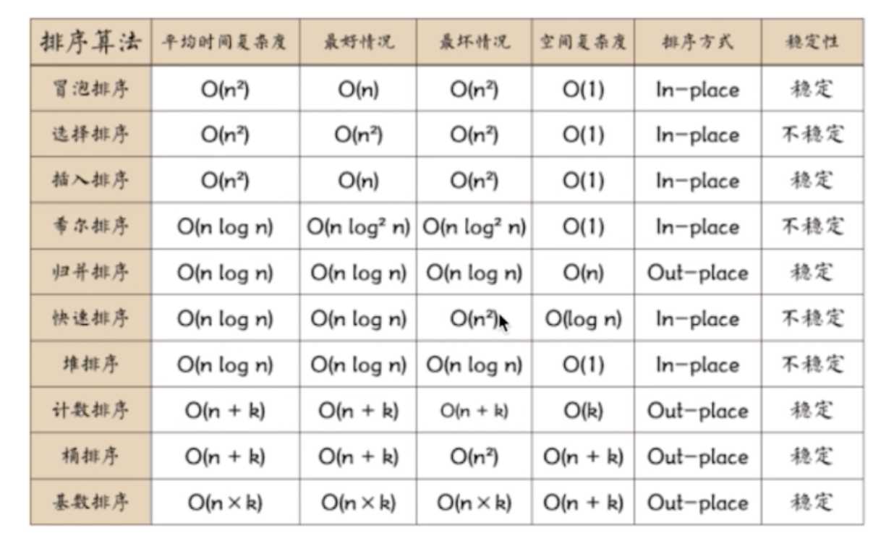

# 算法


* 排序稳定性
  通俗地讲就是能保证排序前两个相等的数其在序列的前后位置顺序和排序后它们两个的前后位置顺序相同。在简单形式化一下，如果Ai = Aj，Ai原来在位置前，排序后Ai还是要在Aj位置前。
  不稳定的排序: 选择排序、快速排序、希尔排序、堆排序
  稳定排序：冒泡排序、插入排序、归并排序、基数排序

## 排序
  * 快速排序（不稳定排序 O(nlog2n)）
  ```
  /*
    通过一趟排序将要排序的数据分割成独立的两部分，其中一部分的所有数据都比另外一部分的所有数据都要小，然后再按此方法对这两部分数据分别进行快速排序，整个排序过程可以递归进行，以此达到整个数据变成有序序列
  */
  /*
    步骤：1.首先设定一个分界值，通过该分界值将数组分成左右两部分；
    2.将大于或等于分界值的数据集中到数组右边，小于分界值的数据集中到数组的左边。此时，左边部分中各元素都小于或等于分界值，而右边部分中各元素都大于或等于分界值;
    3.左边和右边的数据可以独立排序。对于左侧的数组数据，又可以取一个分界值，将该部分数据分成左右两部分，同样在左边放置较小值，右边放置较大值。右侧的数组数据也可以做类似处理
    4.重复上述过程，可以看出，这是一个递归定义。通过递归将左侧部分排好序后，再递归排好右侧部分的顺序。当左、右两个部分各数据排序完成后，整个数组的排序也就完成了
  */

  ```

  * 选择排序（不稳定的排序 O(n^2)）
  ```
  /*
    第一次从待排序的数据元素中选出最小（或最大）的一个元素，存放在序列的起始位置，然后再从剩余的未排序元素中寻找到最小（大）元素，然后放到已排序的序列的末尾。以此类推，直到全部待排序的数据元素的个数为零。选择排序是不稳定的排序方法。
  */

  function selectSort(array) {
    for (let i = 0; i < array.length; i++) {
      let min = i; // 找到最小的位置
      for (let j = 0; j < array.length - i; j++) {
        if (array[j] < array[j + 1]) {
          min = j
        }
      }
      // 将最小元素的位置与改次循环元素交换位置
      swap(array, i, min);
    }
    return array;
  }

  ```

  * 希尔排序（不稳定排序）

  * 冒泡排序（稳定的排序 O(n^2)）
  ```
  /*
    原理： 比较两个相邻的元素，将值大的元素交换到右边
    步骤： 让数组当中相邻的两个数进行比较，数组当中比较小的数值向下沉，数值比较大的向上浮！外层for循环控制循环次数，内层for循环控制相邻的两个元素进行比较。
  */

  function bubbleSort(array) {
    for (let i = 0; i < array.length; i++) {
      for (let j = 0; j < array.length - i; j++) {
        swap(array, j, j + 1)
      }
    }
    return array
  }
  function swap(array, i, j) {
    if (array[i] > array[j]) {
      [array[i], array[j]] = [array[j], array[i]];
    }
  }

  ```

  * 堆排序（不稳定排序）

  * 归并排序（稳定排序）

  * 插入排序（稳定排序）

* 堆栈、队列、链表
  栈
  堆
* 递归
  二分查找

* 波兰式和逆波兰式

* tree
  中序遍历、前序遍历、后续遍历
* 

