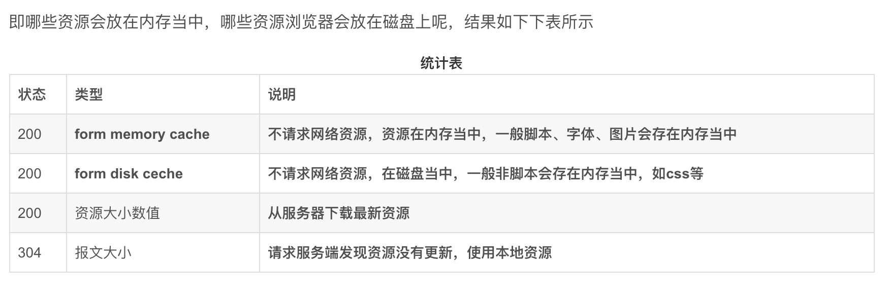

#cache-contole(开启缓存, http1.1版本有效)


## 特性： 可缓存性
* public: 任何节点都可以缓存
* private: 只有请求的浏览器缓存
* no-cache: 本地可以存储缓存，但需要服务器校验是否允许使用缓存, 配合Last-Modified或Etag使用。如：
第一次请求时，在响应头中增加如下内容：
```
  {
    'Cache-Control': 'max-age=1000, no-cache',
    'Last-Modified': '2019-11-01',
    'Etag': '1' // Etag的值以1为示例, 正常为一个数字签名，如hash计算
  }
```
则在第二次请求时，会在请求头中带上如下头部信息:
```
  {
    'If-Modified-Since': '2019-11-01'(第一次响应头中得Last-Modified得值),
    'If-None-Match': '1'(第一次响应头中得Etag得值)
  }
```
服务器在第二次接受到请求时，发现时no-cache， 则服务器端进行比较If-Modified-Since和之前得Last-Modified得值或If-None-Match与Etag得值，如果相同， 则返回304状态码， 浏览器发现304，则从浏览器缓存中拿资源，忽略掉服务器返回得数据

## 特性： 到期
* max-age = 秒：缓存多少秒后过期，过期后浏览器在请求服务端获取心得内容(浏览器上看到得是200 from memory-cache)
* s-maxage： 代替max-age，但只在服务端起作用， 优先级高于max-age
* max-stale: 在指定时间内， 还是可以获取已过期的资源

## 特性：重新验证(浏览器访问页面时很少用到)
* must-revalidate：
* proxy-revalidate:

## 其他
* no-store: 本地、代理服务器都不存缓存，每次都要从服务器上获取
* no-transform: 用在代理服务器上，不允许代理服务器进行资源压缩改动等操作

* memory-cache: 字面理解是从内存中，其实也是字面的含义，这个资源是直接从内存中拿到的，不会请求服务器一般已经加载过该资源且缓存在了内存当中，当关闭该页面时，此资源就被内存释放掉了，再次重新打开相同页面时不会出现from memory cache的情况
* disk-cache: 此资源是从磁盘当中取出的，也是在已经在之前的某个时间加载过该资源，不会请求服务器但是此资源不会随着该页面的关闭而释放掉，因为是存在硬盘当中的，下次打开仍会from disk cache
  
## disk-cache memory-cache 统计



## Pragma: expire(绝对时间， 与cache-control同时存在时， cache-control会覆盖expire)

### 判断缓存流程

参考[cache-control](https://blog.csdn.net/u012375924/article/details/82806617)