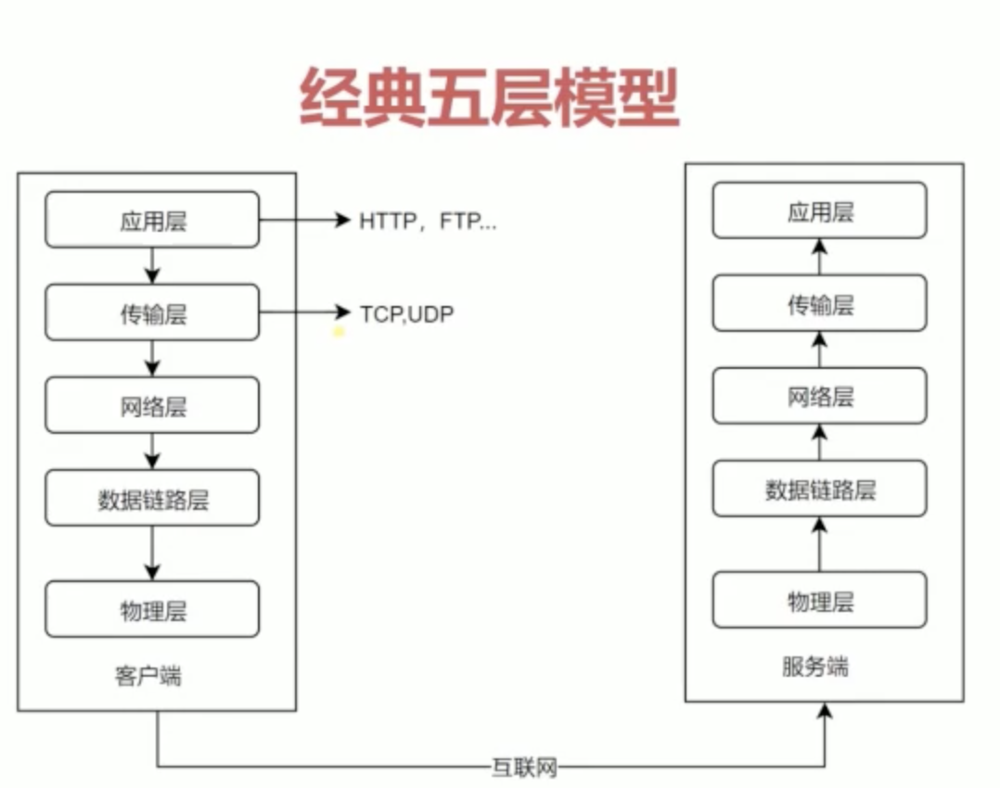

## 五层网络模型（七层）
   
  
* 物理层： 主要作用是定义物理设备如何传输数据, 如网线/网卡
* 数据链路层：在通信实体间建立数据链路的连接
* 网络层： 为数据在节点之间传输创建逻辑链路
* 传输层：（TCP/UDP）为用户提供可靠的端到端的服务， 传输层向高层屏蔽了下层数据通信的细节
* 应用层：（HTTP/FTP）为应用软件提供了很多服务,构建于TCP协议之上，屏蔽了网络传输相关细节