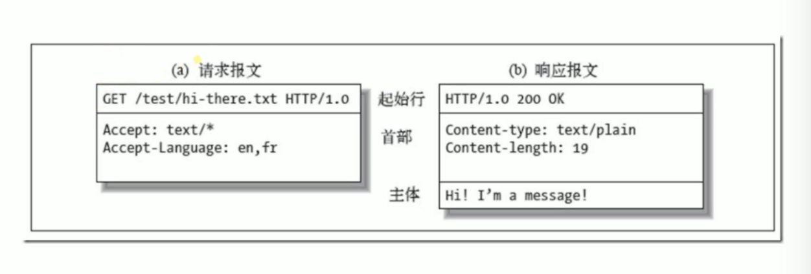

  
## HTTP报文格式

## 请求报文组成说明
  * 首行： 请求方法、请求url、协议/版本
  * 请求头：
  * 空行： 
  * 请求体：
## 响应报文
  * 状态行： 协议/版本、状态码、状态码代表的含义
  * 响应头：
  * 空行
  * 响应体： 

## HTTP方法（用来定义对于资源的操作）
  * get： 获取数据（select）
  * post: 提交数据（新增）
  * put: 更新数据（update）
  * delete: 删除数据（delete）
  * option: 预检请求，测试服务器是否功能正常，如cors时会发送该请求
  * head： 获取报文首部，与get方法一样，都是从服务器上获取指定数据，但不同的是，head返回只有响应头，没有响应体， 多用于客户端查看服务器端性能
  * trace: 回馈服务器收到的请求，用于远程诊断服务器。
  * patch: 与put类似，PATCH一般用于资源的部分更新，而PUT一般用于资源的整体更新
## HTTP CODE(定义服务器对请求的处理结果)
  * 1XX 指示信息-表示请求已接收，继续处理
  * 2XX 成功-表示请求已被成功接收
  * 3XX 重定向 - 要完成请求必须进行更进一步的操作
  * 4XX 客户端操作 - 请求有语法错误活请求无法实现
  * 5XX 服务器错误 - 服务器未能实现合法的请求
  状态码示例：
  200: ok 客户端请求成功
  206: 客户发送了一个带有Rang头的get请求，服务器完成了它，比如音频
  301: 永久重定向
  302: 临时重定向
  304：缓存，服务器告诉客户端可以从浏览器中读取缓存
  400: 客户端请求有语法错误，不能被服务器所理解
  401: 请求未授权
  403: 资源禁止被访问
  404: 请求资源不存在
  500: 
  502:
  503

## HTTP主要特点
  * 无连接： 即每次连接只处理一个请求，服务器处理完客户请求，并收到客户的应答后，即断开连接
  * 无状态： 指协议对于事务处理没有记忆功能，意味着后续处理需要前面的信息，则必须重传
  * 简单快速：客户向服务器请求服务时，只需传送请求方法和路径。请求方法常用的有GET、HEAD、POST。每种方法规定了客户与服务器联系的类型不同。由于HTTP协议简单，使得HTTP服务器的程序规模小，因而通信速度很快。
  * 灵活： HTTP允许传输任意类型的数据对象，通过Content-Type加以标记
  * 支持bs/cs模式

  ## get与post区别
  * get在浏览器回退是无害的，而post会再次提交请求 *
  * get产生的url地址可以被收藏，而post不可以
  * get请求会浏览器主动缓存，而post不会，除非手动设置 *
  * get请求只能进行url编码，而post支持多种编码方式
  * get请求参数会被完整保留在浏览器历史记录里，而post中的参数不会被保留 *
  * get请求在url中传递参数的长度时有限制的（一般2kb，不同浏览器大小不同），而post没有限制 *
  * 对参数的数据类型，get只接受ASCII字符，而post没有限制
  * get比post更不安全，因为参数直接暴露在url上，不能传递敏感信息
  * get参数通过url传递， 而post放到requestbody中 *
