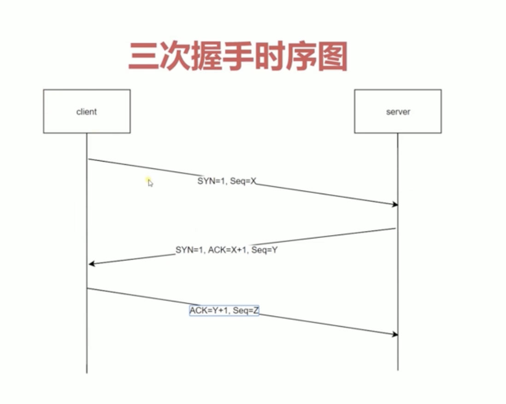

  
## 三次握手

  
  * 1.客户端向服务端发送一个请求，携带syn=1（标志位）， seq=1;
  * 2.服务端接收到客户端请求，开启tcp端口，向客户端发送syn=1， ack=seq+1（也就是2）， seq=Y
  * 3.客户端收到请求后，发送ack = y+1, seq=3;

  三次握手的作用：规避网络延时服务器开销的问题，防止服务端开启无用的端口

* TCP上可以发送多个http请求
