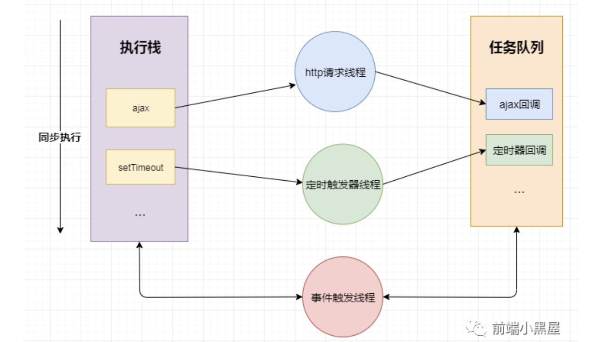
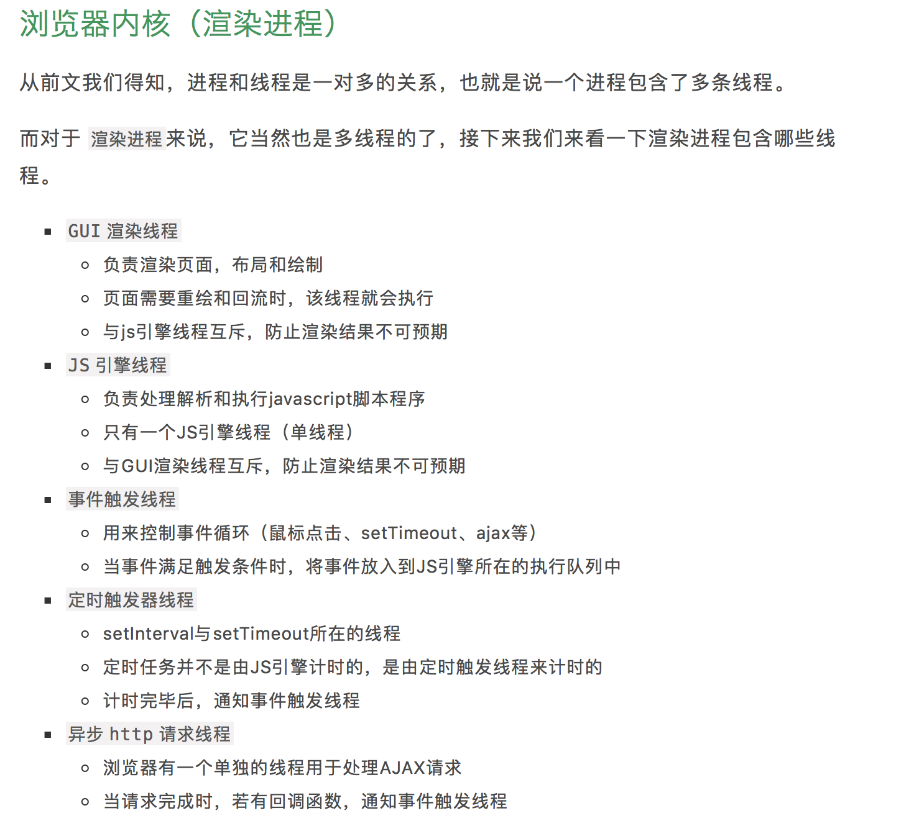

# 什么是事件循环？
* JS引擎线程只执行执行栈中的事件
* 执行栈中的代码执行完毕，就会读取事件队列中的事件
* 事件队列中的回调事件，是由各自线程插入到事件队列中的
* 如此循环
如图所示：

# 什么是宏任务？
我们可以将每次执行栈执行的代码当做是一个宏任务（包括每次从事件队列中获取一个事件回调并放到执行栈中执行）， 每一个宏任务会从头到尾执行完毕，不会执行其他。主代码块，setTimeout，setInterval等，都属于宏任务

# 什么是微任务？
微任务可以理解成在当前 宏任务执行后立即执行的任务。
也就是说，当 宏任务执行完，会在渲染前，将执行期间所产生的所有 微任务都执行完。
Promise，process.nextTick等，属于 微任务。

```
setTimeout(function() {
  console.log(1);
  Promise.resolve(3).then(data => console.log(data))
}, 0)
setTimeout(function(){
  console.log(2)
}, 0)
// 输出132
/* 上面代码共包含两个 setTimeout ，也就是说除主代码块外，共有两个 宏任务， 其中第一个 宏任务执行中，输出 1 ，并且创建了 微任务队列，所以在下一个 宏任务队列执行前， 先执行 微任务，在 微任务执行中，输出 3 ，微任务执行后，执行下一次 宏任务，执行中输出 2
*/
```

# 总结

* 执行一个 宏任务（栈中没有就从 事件队列中获取）
* 执行过程中如果遇到 微任务，就将它添加到 微任务的任务队列中
* 宏任务执行完毕后，立即执行当前 微任务队列中的所有 微任务（依次执行）
* 当前 宏任务执行完毕，开始检查渲染，然后 GUI线程接管渲染
* 渲染完毕后， JS线程继续接管，开始下一个 宏任务（从事件队列中获取）

