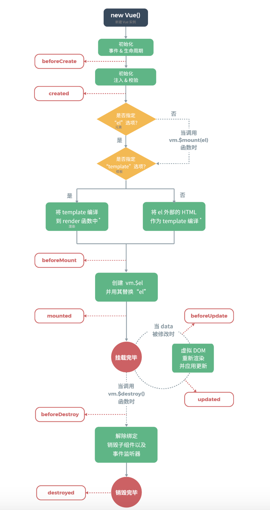

# vue学习记录

* 组件化有什么优势？
  解决高耦合、低内聚、无重用的三个问题
* 组件化与模块化有啥区别？
  组件化：就是基础组件，基础库，把代码重复的部分提炼出一个个组件供给功能使用
    目的：代码服用、解藕
    依赖： 组件间低依赖，比较独立
    架构定位： 纵向分层（位于架构底层，被其他层依赖）
  模块化：就是业务模块，把功能进行划分，将同一类型的代码整合到一起
    目的： 隔离、封装（高内聚）
    依赖：模块之间的依赖关系，可通过路由器进行模块之前的耦合问题
    框架：横向分层（位于架构业务框架层）

* 组件化中的常用技术
  1. 组件间通信、传值
    父与子： props
    引用refs: this.$refs.name.value（this.$refs.name）


# 区别声明式渲染和命令式渲染？
  * 声明式渲染: 只需要声明在哪里需要做什么？不需要关心具体怎么实现的
  ```
    let arr=[2,4,5,6]
    let arr2=arr.map(item=>item*2)
    console.log(arr2)
  ```
  * 命令式渲染: 需要以具体代码表达在哪里做什么？它是如何实现的
  ```
    let arr=[2,4,5,6]
    let arr2=[]
    for(let i=0;i<arr.length;i++){
      arr2.push(arr[i]*2)
    }
  ```

  # vue生命周期
  

## 指令是什么？ 有哪些?
  * 指令： 指令是带有v-的特殊特性
  * 指令的作用： 指令的职责是，当表达式的值改变时，将其产生的连带影响，响应式地作用于 DOM。
  * 指令： v-model、v-bind、 v-on、 v-if、 v-else、 v-else-if、 v-show、 v-for、
## v-if与v-show得区别
  * v-if 是“真正”的条件渲染，因为它会确保在切换过程中条件块内的事件监听器和子组件适当地被销毁和重建。
  * v-show 不管初始条件是什么，元素总是会被渲染，并且只是简单地基于 CSS（display属性） 进行切换。
  * 一般来说，v-if 有更高的切换开销，而 v-show 有更高的初始渲染开销。因此，如果需要非常频繁地切换，则使用 v-show 较好；如果在运行时条件很少改变，则使用 v-if 较好。


## 计算属性（computed）和方法区别
  * 计算属性：是基于它们的响应式依赖进行缓存的。只在相关响应式依赖发生改变时它们才会重新求值。这就意味着只要 message 还没有发生改变
  * 方法：每当触发重新渲染时，调用方法将总会再次执行函数。


## 指令缩写
  * <a v-bind:href='url'>sss</a> -> <a :href='url'>sss</a>
  * <a v-on:click="doSomething">...</a>  -> <a @click="doSOmethin">...</a>

