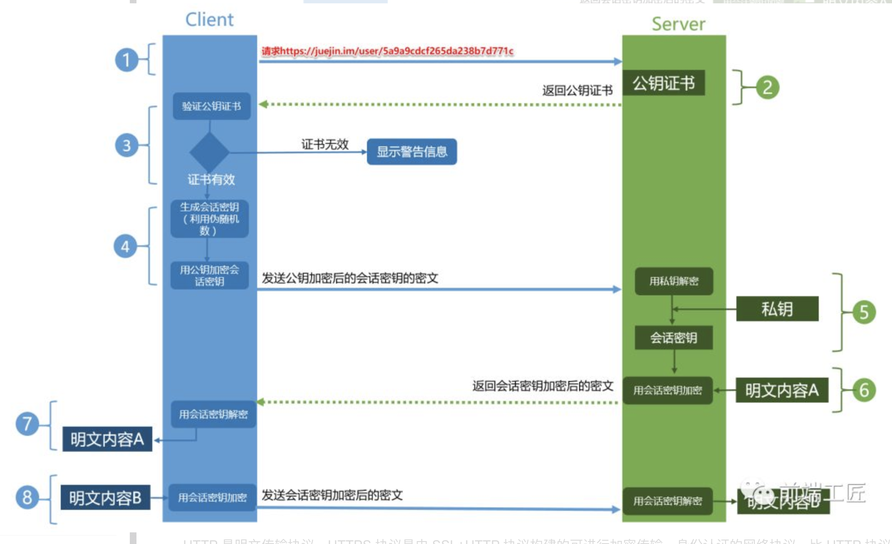
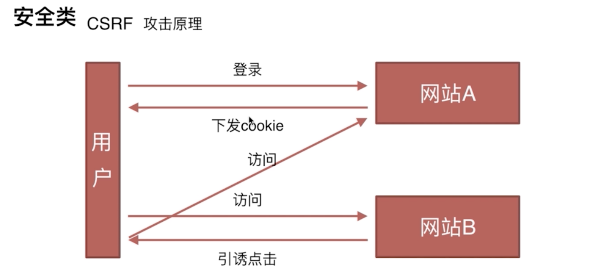

 * js基础
 * js继承方式/apply/bind/new/promise/截流/防抖等操作实现
 * js创建对象的方式
 * react源码/react 全家桶
 * webpack配置相关
 * css布局(flex, grid)
 * css 动画 css3
 * css reflow/repaint
 * es6相关（promise、proxy、async、await、generator）
 * 阮一峰es6
 * 事件循环
 * 算法（基本算法/leetcode）
 * 设计模式
 * node 视频
 * 简历/项目经验
 * web安全、http网络相关
 * typescript/mobx
 * 自动化测试
 * JS垃圾回收机制
 * promise 装饰器 async await
 * css预处理器
 * webpack sourcemap 原理
 
## SSO(Single Sign-On)单点登录原理
 * sso是什么： SSO使得在多个应用系统中，用户只需要 登录一次 就可以访问所有相互信任的应用系统。
 * 原理： 

* 如何实现antd 中form表单

* 双向绑定原理

* react diff算法

* react fiber是什么，做了什么事

* react setState发生了什么

* babel中stage-0、stage-1/2/3都是什么
  1. Stage 0 - 设想（Strawman）：只是一个想法，可能有 Babel插件。
  2. Stage 1 - 建议（Proposal）：这是值得跟进的。
  3. Stage 2 - 草案（Draft）：初始规范。
  4. Stage 3 - 候选（Candidate）：完成规范并在浏览器上初步实现。
  5. Stage 4 - 完成（Finished）：将添加到下一个年度版本发布中。

* https为什么是安全的
  HTTPS协议的主要作用可以分为两种：一种是建立一个信息安全通道，来保证数据传输的安全；另一种就是确认网站的真实性
  HTTPS和HTTP的区别主要如下：
  1. https协议需要到ca申请证书，一般免费证书较少，因而需要一定费用。
  2. http是超文本传输协议，信息是明文传输，https则是具有安全性的ssl加密传输协议。
  3. http和https使用的是完全不同的连接方式，用的端口也不一样，前者是80，后者是443。
  4. http的连接很简单，是无状态的；HTTPS协议是由SSL+HTTP协议构建的可进行加密传输、身份认证的网络协议，比http协议安全

* https认证流程（HTTPS采用对称加密和非对称加密两者并用的混合加密机制。）
  
  1. Client发起一个HTTPS（比如 https://juejin.im/user）的请求，根据RFC2818的规定，Client知道需要连接   Server的443（默认）端口。
  2. Server把事先配置好的公钥证书（public key certificate）返回给客户端。
  3. Client验证公钥证书：比如是否在有效期内，证书的用途是不是匹配Client请求的站点，是不是在CRL吊销列表里面，它的上一级证书是否有效，这是一个递归的过程，直到验证到根证书（操作系统内置的Root证书或者Client内置的Root证书）。如果验证通过则继续，不通过则显示警告信息。
  4. Client使用伪随机数生成器生成加密所使用的对称密钥，然后用证书的公钥加密这个对称密钥，发给Server。
  5. Server使用自己的私钥（private key）解密这个消息，得到对称密钥。至此，Client和Server双方都持有了相同的对称密钥。
  6. Server使用对称密钥加密“明文内容A”，发送给Client。
  7. Client使用对称密钥解密响应的密文，得到“明文内容A”。
  8. Client再次发起HTTPS的请求，使用对称密钥加密请求的“明文内容B”，然后Server使用对称密钥解密密文，得到“明文内容B”。


* Https缺点
  1. HTTPS协议握手阶段比较费时，会使页面的加载时间延长近50%，增加10%到20%的耗电；
  2. SSL证书需要钱，功能越强大的证书费用越高，个人网站、小网站没有必要一般不会用。
  3. SSL证书通常需要绑定IP，不能在同一IP上绑定多个域名，IPv4资源不可能支撑这个消耗。
  4. HTTPS连接缓存不如HTTP高效，会增加数据开销和功耗，甚至已有的安全措施也会因此而受到影响；

* tls/ssl使用何种加密方式？ 对称加密、非对称加密和单向加密的区别？ 有哪些加密算法
  TLS/SSL 的功能实现主要依赖于三类基本算法：散列函数 、对称加密和非对称加密，其利用非对称加密实现身份认证和密钥协商，对称加密算法采用协商的密钥对数据加密，基于散列函数验证信息的完整性。
  1. 散列算法：RSA、ECC、DH
  2. 非对称加密算法：AES、DES、RC4， 公开密钥加密使用一对非对称的密钥。一把叫做私有密钥，另一把叫做公开密钥。顾名思义，私有密钥不能让其他任何人知道，而公开密钥则可以随意发布，任何人都可以获得。
  使用公开密钥加密方式，发送密文的一方使用对方的公开密钥进行加密处理，对方收到被加密的信息后，再使用自己的私有密钥进行解密。利用这种方式，不需要发送用来解密的私有密钥，也不必担心密钥被攻击者窃听而盗走。
  3. 对称加密算法：MD5、SHA， 这种方式加密和解密同用一个密钥。加密和解密都会用到密钥。没有密钥就无法对密码解密，反过来说，任何人只要持有密钥就能解密了。

* option预检请求如何实现缓存（嗅探请求，即只发送一次预检请求，之后就不发了）

* last-modified存在什么问题？

* etag如何计算出来的

* md5原理是什么

* promise/generator/async await区别及优缺点

* 如何实现一个require

* 事件循环，async await在哪个任务队列执行

* css性能，js阻塞渲染

* prefetch/preload的区别
  perload（不支持ie）： link标签的preload是一种声明式的资源获取请求方式，用于提前加载一些需要的依赖，并且不会影响页面的onload事件
  特点：1）preload加载的资源是在浏览器渲染机制之前进行处理的，并且不会阻塞onload事件；
       2）peload可以支持加载多种类型的资源，并且可以加载跨域资源；
       3) preload加载的js脚本其加载和执行的过程是分离的。即preload会预加载相应的脚本代码，待到需要时自行调用；
  示例： <link rel="preload" as="font" href="www.font.com" crossorigin="anonymous">

  prefetch（支持ie11）: prefetch是一种利用浏览器的空闲时间加载页面将来可能用到的资源的一种机制；通常可以用于加载非首页的其他页面所需要的资源，以便加快后续页面的首屏速度；
  特点：prefetch加载的资源可以获取非当前页面所需要的资源，并且将其放入缓存至少5分钟（无论资源是否可以缓存）；并且，当页面跳转时，未完成的prefetch请求不会被中断；

  对比：1）preload和prefetch都没有同域名的限制；
       2）preload主要用于预加载当前页面需要的资源；而prefetch主要用于加载将来页面可能需要的资源；
       3）不论资源是否可以缓存，prefecth会存储在net-stack cache中至少5分钟；
       4）preload需要使用as属性指定特定的资源类型以便浏览器为其分配一定的优先级，并能够正确加载资源；
  ```
    // 判断是否支持preload
    const preloadSupported = () => {
      const link = document.createElement('link');
      const relList = link.relList;
      if (!relList || relList.supports)
        return false;
      return relList.supports('preload');
    }
  ```
* 浏览器资源加载优先级(Highest 、 Medium 、 Low 、 Lowest 、 Idle)
  浏览器首先会按照资源默认的优先级确定加载顺序：
    html 、 css 、 font 这三种类型的资源优先级最高；
    然后是 preload 资源（通过 <link rel="preload"> 标签预加载）、 script 、 xhr 请求；
    接着是图片、语音、视频；
    最低的是prefetch预读取的资源。
* 资源优先级提升
  浏览器会按照如下规则，对优先级进行调整：

  对于XHR请求资源：将同步 XHR 请求的优先级调整为最高。
  对于图片资源：会根据图片是否在可见视图之内来改变优先级。图片资源的默认优先级为 Low 。现代浏览器为了提高用户首屏的体验，在渲染时会计算图片资源是否在首屏可见视图之内，在的话，会将这部分视口可见图片 ( Image in viewport ) 资源的优先级提升为 High 。
  对于脚本资源：浏览器会将根据脚本所处的位置和属性标签分为三类，分别设置优先级。
  首先，对于添加 defer / async 属性标签的脚本的优先级会全部降为 Low 。
  然后，对于没有添加该属性的脚本，根据该脚本在文档中的位置是在浏览器展示的第一张图片之前还是之后，又可分为两类。在之前的 ( 标记 early** ) 它会被定为High优先级，在之后的 ( 标记 late** ) 会被设置为 Medium 优先级。

* Chrome有四种缓存：http cache、memory cache、Service Worker cache和Push
* 编译型和解释型语言的区别
  编译型： 只须编译一次就可以把源代码编译成机器语言，后面的执行无须重新编译，直接使用之前的编译结果就可以；因此其执行的效率比较高；比如C、C++
  解释性：源代码不能直接翻译成机器语言，而是先翻译成中间代码，再由解释器对中间代码进行解释运行，程序不需要编译，程序在运行时才翻译成机器语言，每执行一次都要翻译一次；如：JavaScript、Python

* null 与 undefined的区别
  Undefined类型只有一个值，即undefined。当声明的变量还未被初始化时，变量的默认值为undefined。
  Null类型也只有一个值，即null。null用来表示尚未存在的对象，常用来表示函数企图返回一个不存在的对象。

* indexof的实现

* 箭头函数this指向（内部和外部）

* setTimeout和setInterval区别
  setTimeout(fn,t),超时调用，超过时间t，就执行fn。
  setInterval(fn,t),间歇调用，调用周期t，执行fn。
  setInterval存在的问题：
      1.当setInterval中函数执行时间大于了延时时间， 当到了延时时间，即使函数没有执行完毕，也会再次将函数放到任务队列中,间隔时间不等于预设的间隔时间。
      2.当函数执行时间很长的时候，后续被添加到任务队列中函数会被忽略掉，因为务队列中不会有两个及以上同一个定时器的回调函数
  ```
  // 使用setTimeout替换setInterval，保证间隔时间相同
    var y=0;
    var z = new Date().getTime();
    var t = setTimeout(b,500);
    function b(){
      y++;
      sleep(2000)
      if(y>=10){
          clearTimeout(t)
      }else{
          setTimeout(arguments.callee,500);
      }
      console.log(new Date().getTime()-z);
    }
    function sleep(sleepTime){
        var start=new Date().getTime();
        while(true){
            if(new Date().getTime()-start>sleepTime){
                break;    
            }
        }
    }

  ```

 * ES6类与ES5类的区别
  ES6中方法不可枚举，而es5方法除构造函数之外，其他方法可枚举
  
 * 单页应用优缺点
  优点：1.减少服务器压力，响应速度提升；2.不需要刷新页面，用户体验好
  缺点：1.不利于SEO
 * 单页应用原理
   1. History方式实现（优雅，url中不带#）
   ```
   ```
   2. Hash方式实现（兼容性好） 
   ```
    window.onhashchange = function() {
      let page = location.hash;
      if (page === "#home") {
        document.getElementById("main").innerHTML = "这是首页";
        return;
      } else if (page === "#help") {
        document.getElementById("main").innerHTML = "这是帮助页面";
        return;
      }
    };

   ```
  * react事件系统

  * line-height
    行高是指文本行基线间的垂直距离

  * line-height 1.5 与 150%区别
    区别体现在子元素继承时，如下：
    父元素设置line-height:1.5会直接继承给子元素，子元素根据自己的font-size再去计算子元素自己的line-height。
    父元素设置line-height:150%是计算好了line-height值，然后把这个计算值给子元素继承，子元素继承拿到的就是最终的值了。此时子元素设置font-size就对其line-height无影响了
    示例：
    比如父元素设置属性：font- size:14px;line-height:1.5,child设置font-size:26px;
    那么父元素：line-height = 14px * 1.5 = 21px，子元素：line-height = 26px * 1.5 = 39px。
    父元素设置属性：font-size:14px;line-height:150%,child设置font-size:26px;
    那么父元素：line-height = 14px * 150% = 21px，子元素：line-height = 父元素的line-height = 21px。

* em和rem的区别
  em相对父级元素设置的font-size来设置大小 如果父元素没有设置font-size ，则继续向上查找，直至有设置 font-size元素
  rem直接参照html标签字体大小，并且所有使用rem单位的都是参照html标签

* css伪类选择器有哪些，新增的伪类选择器有哪些
  :link :active :hover :visited :focus :blur
  新增的：:nth-child(n) 第一个元素 odd/2n+1表基数 even/2n表偶数
        :first-child 第一个子元素
        :last-child 最后一个元素
        :first-of-type 第一个同级兄弟元素
        :nth-of-type(n) 第几个同级别兄得元素
        :not-last-child(n) 倒数第几个元素
        :empty 选择的元素里面没有任何内容

* css 伪元素有哪些
  ::before 在元素之前添加内容
  ::after 在元素之后添加内容
  ::first-letter 向文本的第一个字母添加特殊样式
  ::first-line 向文本的首行添加特殊样式

* 隐藏一个元素的方式有哪些
  1. opacity: 0 通过透明度设置为0 隐藏元素， 视觉上隐藏，元素本身依旧占用他的位置，对网页的布局起到作用，在读屏软件中会被识别
  2. visible: hidden 不影响交互，在读屏软件中不会被识别
  3. display:none 不占据位置，不影响交互，无法被读屏软件识别，不会被点击，除以下场景
  ```
    <input id="hide" type="submit" style="display:none"/>
    <label for="hide">点击触发提交</label>
    // input被隐藏，但惦记label仍会被选中
  ```
  4. position: absolute; top: -99999；left:-9999 设置绝对定位，将元素移除可视区域

* display:none 和 visible:hidden的区别
  1. display:none设置后，该元素以及它的子元素都会被隐藏，隐藏后的元素无法被点击，无法使用屏幕阅读器识别，占据空间消失
  visible:none设置后，依旧占用原来空间，他的子元素会继承这个属性，如果重新给子元素设置visible:visible，则子元素又回显示出来
  2. visibility: hidden不会影响计数器的计数，visibility: hidden虽然让一个元素不见了，但是其计数器仍在运行。这和display: none完全不一样, display:none则会忽略掉该元素，如下：
  ```
  <body>
        <div>
            <strong>给元素设置visibility:hidden样式</strong>
            <ol>
                <li>元素1</li>
                <li style="visibility:hidden;">元素2</li>
                <li>元素3</li>
                <li>元素4</li>
            </ol>
        </div>
        <div>
            <strong>给元素设置display:none样式</strong>
            <ol>
                <li>元素1</li>
                <li style="display:none;">元素2</li>
                <li>元素3</li>
                <li>元素4</li>
            </ol>
        </div>
    </body>
    // visible:hidden 则会计数器为 
    1.元素1
     
    3.元素3
    4.元素4
    // display:none则会
    1.元素1
    2.元素3
    3.元素4
    
  ```
  3. css3中的transition支持visible， 但不支持display

* 优化前端页面性能方式


 ### 单词缩写
  * DOM  document object model
  * xss
      跨域脚本攻击（cross-site scripting）
    防御方式：
      1. 编码： 将<、> ‘’、& 空格转化成转义字符
      2. 过滤: 
      3. 校正: 
      4. 服务端对敏感的Cookie设置 httpOnly属性，使js脚本不能读取到cookie
      5. Content Security Policy(内容安全策略): 
          http头中设置Content-Security-Policy: policy；
          设置meta标签 <meta http-equiv="Content-Security-Policy" content="form-action 'self';">
  * csrf
    
    跨站请求伪造cross site request forgery
    产生必要两个步骤：1.在注册网站登录过、2.该网站某个接口存在这个漏洞

    csrf防御措施：
      1.token验证(登录过之后， 服务器下发token给客户端，每次请求时都手动携带token，cookie会自动携带，但token不会)
      2.refere验证
      3.隐藏令牌(放到http头中)

  * csrf与xss区别
    1.xss不需要用户登录注册，向页面中注入js，让js在执行，做想要做的事
    2.csrf：利用接口漏洞，需要用户登录
  
  * cors
  
  * 

### DOM 和 BOM

### 问题：
  * for in 与 for of区别
  * new Foo 和 new Foo（）
  * 闭包应用场景
  * Document对象属性、方法
  * Object对象属性方法
  * Object.create()以及Object.create方法实现
    Object.create()方法创建一个新对象，使用现有的对象来提供新创建的对象的__proto__。
  * 301 与 302 304 403区别
  * 跨域解决方式/原理
  * 图片盗链问题
  * git常用命令， 对应场景
  * 正则表达式
  * JS模块化
  * 输入url到渲染出html的过程是怎样的
  * Object.assign方法浅拷贝， 深拷贝如何实现
  * es6中super的作用及示例
  * Promise是什么，解决什么问题， promise settimeout问题
  * 自定义iterator接口
  * url上的hash作用
  * axiso fetch 语法
  * Content-Type的值有哪些
  * 缓存（协商缓存、持久缓存）
  * 移动端适配
  * h5中input新增type有哪些
  * 图片3px缝隙问题
  * 定高/不定高垂直居中()
  * 浮动BFC问题
  * css单位有哪些
  * 替换元素和非替换元素：而根据是否具有可替换内容，我们也可以把元素分为替换元素和非替换元素。这种通过修改某个属性值，例如  的 "src" 属性，<input> 的 "type" 属性，呈现的内容就可以被改变的元素称为替换元素，例如：,<input>,<textarea>,<select> 等等, 且元素一般拥有固定的尺寸（宽高或宽高比）
  * 移动端适配方案
  * js外链异步加载方式
  * 事件捕获、事件冒泡、事件委托
    事件委托: 利用事件冒泡的特性，将里层的事件委托给外层事件，根据event对象的属性进行事件委托，改善性能。
使用事件委托能够避免对特定的每个节点添加事件监听器；事件监听器是被添加到它们的父元素上。事件监听器会分析从子元素冒泡上来的事件，找到是哪个子元素的事件。
  * meta csrf-token
  * react和vue比较，优缺点，适用场景
  * 块级元素有哪些， 行内元素有哪些
  * 正则表达式
  * 
  